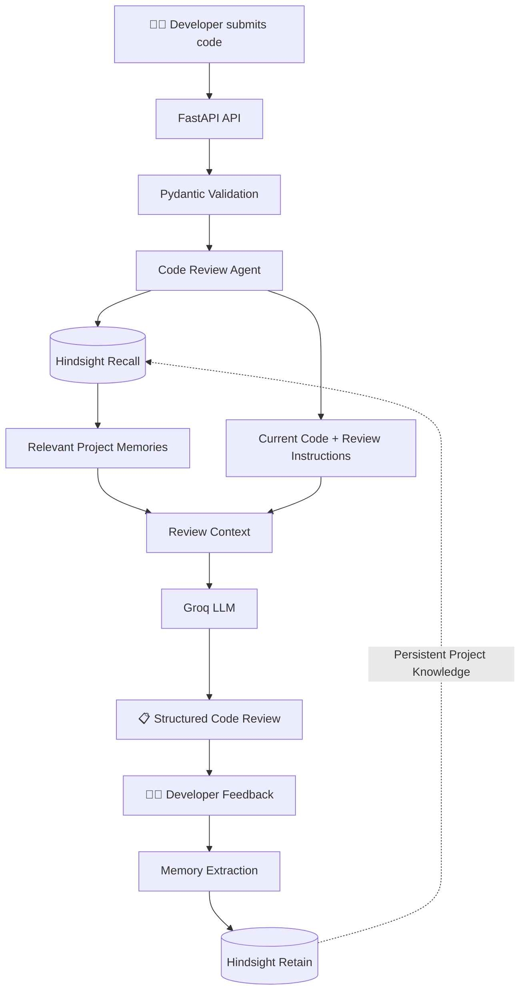

<div align="center">

# 🧠 Hindsight Code Review Agent

### An AI code reviewer that **remembers your project's engineering decisions.**

**Review → Feedback → Remember → Recall → Better Review**

[](https://www.python.org/)
[](https://fastapi.tiangolo.com/)
[](https://groq.com/)
[](https://github.com/vectorize-io/hindsight)
[](https://docs.pydantic.dev/)
[]()

**What makes it different?**

> Most AI reviewers know how to review code.  
> **This one can learn how *your project* wants its code reviewed.**

</div>

---

## 🎯 The Problem

AI code reviewers are good at applying general software-engineering best practices.

But **general best practices are not always the right decision for a specific codebase.**

Imagine a project that intentionally uses synchronous `requests`:

```python
response = requests.get(url)
```

A generic AI reviewer might respond:

> ❌ "Consider migrating to an async HTTP client for better scalability."

The suggestion may be technically reasonable.

But what if the project has already decided:

> **"Keep the project synchronous unless there is a concrete requirement for async behavior."**

The developer rejects the suggestion.

A few days later, another review happens.

The AI has forgotten.

The same recommendation appears again.

### That's the problem.

The reviewer understands the code.

**It doesn't understand the history behind the code.**

---

# 💡 The Solution

This project combines an LLM-based code reviewer with **Hindsight persistent agent memory**.

Instead of treating every code review as an isolated interaction, the agent can:

```text
Review
   ↓
Developer Feedback
   ↓
Retain Project Knowledge
   ↓
Future Recall
   ↓
More Context-Aware Review
```

For example, the developer teaches the agent:

```text
"Keep the project synchronous unless there is
a concrete requirement for async behavior."
```

That decision is retained in Hindsight.

During a future review, the agent recalls the relevant project memory and considers it alongside the current code.

The recommendation can therefore become:

> ✅ "This project intentionally uses synchronous `requests`. Keep the current approach unless a concrete async requirement appears."

### The key idea

> **The code didn't change. The context available to the agent did.**

---

# 🧠 Hindsight Is the Memory Layer

Hindsight is not simply being used as another database.

It is the component that gives the reviewer **persistent project context**.

The agent uses two important memory operations:

### Recall

Before reviewing code, the agent retrieves memories relevant to the current review.

These memories can represent things such as:

- Project conventions
- Developer preferences
- Architectural decisions
- Previous review decisions
- Accepted or rejected recommendations
- Recurring issues

### Retain

After developer feedback, meaningful durable knowledge can be stored for future reviews.

This creates a continuous learning loop:

```text
Developer
    │
    ▼
Code Review
    │
    ▼
Developer Feedback
    │
    ▼
Memory Extraction
    │
    ▼
Hindsight Retain
    │
    ▼
Persistent Project Knowledge
    │
    ▼
Hindsight Recall
    │
    ▼
Future Code Review
```

---

# 🔁 Technical Architecture



## How the system works

### 1. Submit

The developer submits code to the FastAPI application.

### 2. Validate

Pydantic validates the request and the structured data used by the application.

### 3. Recall

The Code Review Agent queries Hindsight for memories relevant to the submitted code.

Example:

```text
Project uses requests for HTTP calls.

Keep the project synchronous.

Do not introduce async unless there is
a concrete asynchronous requirement.
```

### 4. Build Review Context

The agent combines:

```text
Current Code
     +
Review Instructions
     +
Relevant Hindsight Memories
     ↓
Review Context
```

The recalled memories become part of the context supplied to the LLM.

### 5. Review

The review context is sent to the Groq-hosted LLM.

The LLM analyzes the code while considering the project's existing engineering decisions.

### 6. Return the Review

The application returns the generated code review as structured output.

### 7. Developer Feedback

The developer can respond to the recommendation.

For example:

```text
We intentionally keep this project synchronous.
Don't recommend async unless there is a concrete requirement.
```

### 8. Retain

Meaningful, durable information can be extracted from the feedback and retained in Hindsight.

### 9. Future Review

When similar code is reviewed later, the agent can recall that project knowledge.

---

# 🎬 Before vs. After

| | Without Memory | With Hindsight Memory |
|---|---|---|
| Context | Current code + general LLM knowledge | Current code + project history |
| Recommendations | Generic | Project-aware |
| Project conventions | Unknown | Recalled |
| Previous decisions | Forgotten | Available to future reviews |
| Rejected recommendations | Can reappear | Can be remembered |
| Knowledge over time | Stateless | Persistent |
| Review behavior | Same context every time | Context improves over time |

### Example

**Review #1**

```text
No relevant memory
        ↓
Generic recommendation
        ↓
Developer provides feedback
        ↓
Decision retained
```

**Review #2**

```text
Similar code
      ↓
Hindsight Recall
      ↓
Previous project decision retrieved
      ↓
LLM receives project context
      ↓
Project-aware recommendation
```

---

# 🖥️ Demo

The interface makes the memory behavior visible during review.

It shows:

- Code submitted for review
- Hindsight connection status
- Recalled project memories
- Memory-aware review output
- Project-specific recommendations

### Example recalled memory

```text
Do not recommend replacing requests with httpx
unless there is a concrete requirement for async HTTP.

Project convention for code reviews.
```

### Result

Instead of repeatedly suggesting an architectural change that the team has already rejected, the reviewer can respect the project's existing decision.

> **The important demonstration is not that the model can review code.  
> The important demonstration is that the review changes because the agent remembers.**

---

# ✨ Key Features

### 🧠 Persistent Project Memory

Project-specific engineering knowledge can survive beyond an individual review.

### 🔎 Context-Aware Reviews

Relevant memories are recalled before the LLM generates its review.

### 🔄 Feedback-Driven Learning

Developer feedback can become durable project knowledge.

### 🏗️ Project Conventions

The reviewer can remember conventions and architectural decisions instead of repeatedly applying generic recommendations.

### 🛡️ Selective Memory

Temporary questions, hypotheticals, or one-off instructions should not automatically become permanent project rules.

### 📦 Structured I/O

Pydantic provides validation for structured application inputs and outputs.

### ⚡ FastAPI Backend

A lightweight API layer connects the review workflow, memory layer, and LLM.

---

# 🗂️ Memory Types

The project is designed around several useful categories of project knowledge:

| Memory Type | Purpose |
|---|---|
| `project_convention` | Coding and architectural conventions |
| `developer_preference` | Developer-specific preferences |
| `review_decision` | Decisions made during reviews |
| `accepted_suggestion` | Recommendations accepted by the developer |
| `rejected_suggestion` | Recommendations intentionally rejected |
| `recurring_issue` | Problems appearing repeatedly |
| `architectural_decision` | Important project-level technical decisions |

The goal is not to remember everything.

The goal is to remember **what will matter during future reviews**.

---

# 🧩 Design Decisions

## Recall instead of blindly injecting all memory

The agent retrieves memories relevant to the current review rather than treating the entire memory store as context.

This keeps the review focused on information that matters.

## Selective Retention

Not every conversation should become permanent project knowledge.

The system is designed around retaining meaningful, durable decisions rather than temporary instructions.

## One Memory Bank for the MVP

The current MVP uses a single memory bank:

```text
code-review-agent
```

Per-project and per-user memory isolation is part of the future roadmap.

---

# 🛠️ Tech Stack

| Technology | Role |
|---|---|
| **Python** | Core application |
| **FastAPI** | API/backend layer |
| **Groq** | LLM inference |
| **Hindsight** | Persistent agent memory |
| **Pydantic** | Data validation |

---

# 📁 Project Structure

```text
hindsight-code-review-agent/
│
├── app/
│   ├── main.py
│   ├── ...
│
├── tests/
│   └── ...
│
├── ARCHITECTURE.md
├── requirements.txt
├── .env.example
├── README.md
└── ...
```

The exact structure may evolve as the project grows.

---

# 🚀 Getting Started

## 1. Clone the repository

```bash
git clone https://github.com/g-sri-harshit/hindsight-code-review-agent.git
cd hindsight-code-review-agent
```

## 2. Create a virtual environment

### Windows

```bash
python -m venv .venv
.venv\Scripts\activate
```

### macOS / Linux

```bash
python3 -m venv .venv
source .venv/bin/activate
```

## 3. Install dependencies

```bash
pip install -r requirements.txt
```

## 4. Configure environment variables

Create a `.env` file based on `.env.example` and provide the required credentials/configuration.

```bash
cp .env.example .env
```

On Windows PowerShell, you can create the file manually if `cp` is unavailable.

## 5. Start the API

```bash
uvicorn app.main:app --reload
```

The API will be available at:

```text
http://localhost:8000
```

FastAPI documentation:

```text
http://localhost:8000/docs
```

---

# 🧪 Testing

Run the test suite with:

```bash
pytest tests/
```

---

# ⚠️ Current Limitations

This is an **MVP** focused on demonstrating persistent, project-aware code review.

Current limitations include:

- Single shared memory bank
- No complete per-repository/user memory isolation
- No sophisticated memory conflict resolution
- No memory expiry/lifecycle system
- No repository-wide code understanding
- No automated GitHub Pull Request integration
- Limited evaluation coverage
- Developer feedback is trusted and could potentially introduce incorrect or unwanted memories
- No comprehensive mechanism yet for detecting outdated project decisions

These limitations are intentionally surfaced rather than hidden.

---

# 🗺️ Roadmap

### Phase 1 — MVP

- [x] LLM-powered code review
- [x] Hindsight memory integration
- [x] Memory recall during review
- [x] Feedback-driven memory retention
- [x] Project-aware recommendations

### Phase 2 — Repository Intelligence

- [ ] Per-repository memory banks
- [ ] GitHub repository integration
- [ ] Pull Request review bot
- [ ] Repository-wide context
- [ ] File and dependency awareness

### Phase 3 — Memory Lifecycle

- [ ] Memory conflict detection
- [ ] Outdated-memory detection
- [ ] Memory expiration/versioning
- [ ] Developer memory editing
- [ ] Memory audit trail

### Phase 4 — Evaluation

- [ ] Benchmark generic vs memory-aware reviews
- [ ] Measure repeated recommendation reduction
- [ ] Evaluate memory retrieval relevance
- [ ] Test memory poisoning scenarios
- [ ] Build a reproducible evaluation suite

---

# 🔬 What We Want to Prove

The interesting question is not:

> **"Can an LLM review code?"**

Modern LLMs can already do that.

The question is:

> **"Can an AI reviewer become increasingly aligned with the engineering decisions of a specific project over time?"**

A useful progression looks like:

```text
Interaction 1
      ↓
Generic review
      ↓
Developer teaches the agent
      ↓
Interaction 5
      ↓
More project-aware review
      ↓
Interaction 20
      ↓
Reviewer has accumulated useful project context
```

That is the behavior this project is exploring.

---

# 🎯 Why Persistent Memory Matters

A codebase contains more than source code.

It also contains decisions:

```text
Why was this library chosen?
Why was this architecture kept?
Which recommendations were rejected?
What conventions does this team follow?
Which trade-offs were intentional?
```

Traditional stateless AI review sees mostly the **current code**.

A memory-enabled reviewer can additionally use **the history behind the code**.

```text
                 ┌──────────────────┐
                 │   Current Code   │
                 └────────┬─────────┘
                          │
                          ▼
                 ┌──────────────────┐
                 │  Hindsight       │
                 │  Project Memory  │
                 └────────┬─────────┘
                          │
                          ▼
                 ┌──────────────────┐
                 │  Review Context  │
                 └────────┬─────────┘
                          │
                          ▼
                    ┌───────────┐
                    │  Groq LLM │
                    └─────┬─────┘
                          │
                          ▼
                  Project-aware Review
```

---

# 📚 Resources

- **Project Repository:**  
  https://github.com/g-sri-harshit/hindsight-code-review-agent

- **Technical Article:**  
  https://dev.to/sri_harshitgolla_1899642/i-built-a-code-review-agent-that-remembers-with-hindsight-e4l

- **Hindsight:**  
  https://github.com/vectorize-io/hindsight

- **FastAPI:**  
  https://fastapi.tiangolo.com/

- **Pydantic:**  
  https://docs.pydantic.dev/

---

# 🤝 Contributing

Ideas, feedback, and improvements are welcome.

Potential areas for contribution include:

- Better memory retrieval
- Memory lifecycle management
- Repository-aware context
- GitHub PR integration
- Evaluation benchmarks
- Memory safety
- Developer-facing memory controls

---

# 📄 License

This project is currently an MVP and does not yet declare a software license.

---

<div align="center">

### 🧠 Review once. Remember forever.

**Code → Review → Feedback → Hindsight → Recall → Better Review**

Built with Python, FastAPI, Groq, Pydantic and Hindsight.

</div>
